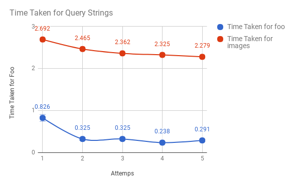

# MP1 Report

Justin Loew - jloew2

Arvind Arunasalam - arunasa2

## System Architecture

The algorithm we chose to implement is fairly barebones. In one sentence, we run grep on the remote machines and pipe the results back over the network. We have one executable that can act as either a client or server.

The server is started on each machine to be queried. The files to be searched may be passed to the server as command line arguments, or the file selection may be omitted to search the default log files. Each machine runs our grep in server mode. The server can handle one client at a time, though this can be easily rectified by spinning up a thread to handle each incoming request. Each request coming in over the line consists of a TCP stream containing the query string as it should be given to grep. A pipe is set up and grep is executed. The server passes the contents of the pipe directly to the client over the network, with a nul byte used to end the stream. Once the server has finished servicing a request, it proceeds on to the next pending client request, waiting if no request is currently available.

The client takes as command line arguments the options and queries to be sent to the remote grep. It starts a thread for each of the 10 servers, and tries to connect in parallel. It sends the query, followed by a nul byte used to signify completion. The client then receives a raw string stream, which is placed into a separate file for each server. When all servers have finished transmitting their results, the client can print the grand total hit count and exit.

## Performance

The average time taken for foo is 0.401

The average time taken for images is 2.426
